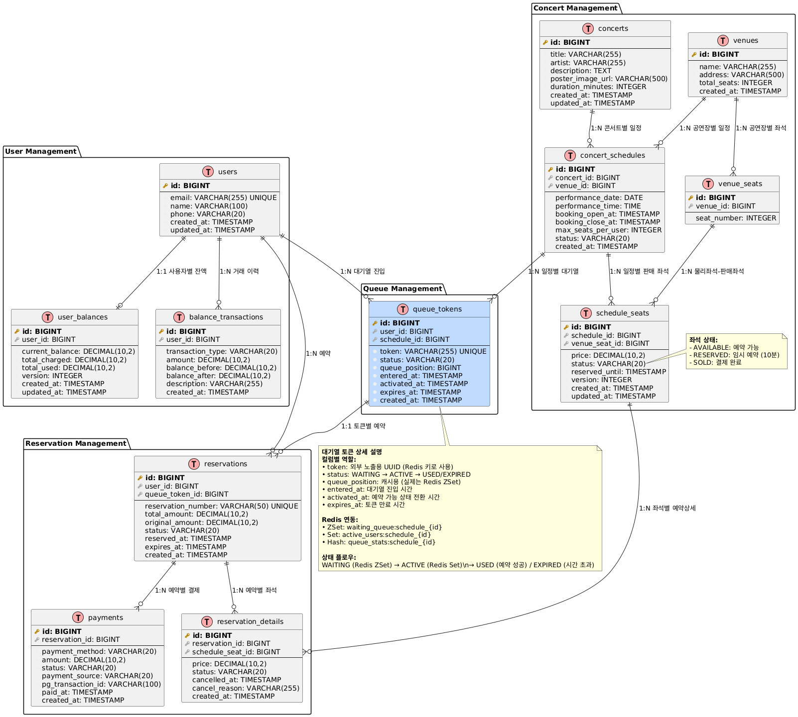
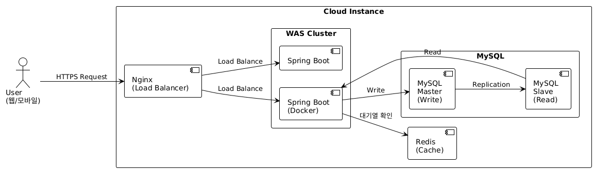
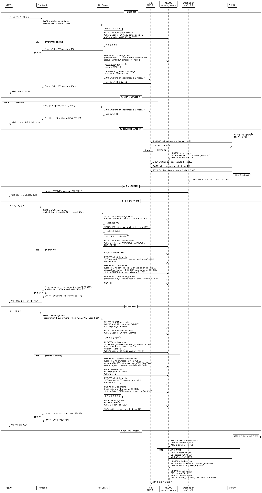

# 서버 설계 문서

## API 명세서

### 1. 유저 대기열 토큰 발급

**Endpoint**: `POST /api/v1/queue/tokens`

**Request**:
```json
{
  "userId": "number",
  "scheduleId": "number"
}
```

**Response**:
- **200 OK**: 토큰 발급 성공
```json
{
  "success": true,
  "data": {
    "token": "string (UUID)",
    "queuePosition": "number",
    "estimatedWaitTimeMinutes": "number",
    "status": "WAITING"
  }
}
```

**Error**:
- **400 Bad Request**: 잘못된 요청 데이터
- **404 Not Found**: 사용자 또는 스케줄이 존재하지 않음
- **409 Conflict**: 이미 해당 스케줄에 대한 토큰이 존재

**Authorization**: None (토큰 발급용)

---

### 2. 예약 가능 날짜 조회

**Endpoint**: `GET /api/v1/concerts/{concertId}/schedules`

**Request**:
- Path Parameters:
  - `concertId`: 콘서트 ID
- Query Parameters:
  - `fromDate` (optional): 조회 시작 날짜 (YYYY-MM-DD)
  - `toDate` (optional): 조회 종료 날짜 (YYYY-MM-DD)

**Response**:
- **200 OK**: 조회 성공
```json
{
  "success": true,
  "data": [
    {
      "scheduleId": "number",
      "concertId": "number",
      "concertTitle": "string",
      "venueId": "number",
      "venueName": "string",
      "performanceDate": "string (YYYY-MM-DD)",
      "performanceTime": "string (HH:mm:ss)",
      "bookingOpenAt": "string (ISO 8601)",
      "bookingCloseAt": "string (ISO 8601)",
      "availableSeats": "number",
      "status": "string"
    }
  ]
}
```

**Error**:
- **400 Bad Request**: 잘못된 날짜 형식 또는 콘서트 ID
- **404 Not Found**: 콘서트가 존재하지 않음
- **500 Internal Server Error**: 서버 오류

**Authorization**: Queue Token required (Header: `Queue-Token: {token}`)

---

### 3. 예약 가능 좌석 조회

**Endpoint**: `GET /api/v1/concerts/{concertId}/schedules/{scheduleId}/seats`

**Request**:
- Path Parameters:
  - `concertId`: 콘서트 ID
  - `scheduleId`: 스케줄 ID

**Response**:
- **200 OK**: 좌석 조회 성공
```json
{
  "success": true,
  "data": {
    "scheduleInfo": {
      "scheduleId": "number",
      "concertTitle": "string",
      "performanceDate": "string",
      "performanceTime": "string",
      "venueName": "string"
    },
    "seats": [
      {
        "seatId": "number",
        "seatNumber": "number",
        "price": "number",
        "status": "AVAILABLE"
      }
    ]
  }
}
```

**Error**:
- **400 Bad Request**: 잘못된 ID 값
- **401 Unauthorized**: 유효하지 않은 큐 토큰
- **404 Not Found**: 콘서트 또는 스케줄이 존재하지 않음

**Authorization**: Queue Token required (Header: `Queue-Token: {token}`)

---

### 4. 좌석 예약 요청

**Endpoint**: `POST /api/v1/reservations`

**Request**:
```json
{
  "scheduleId": "number",
  "seatIds": ["number", "number"],
  "userId": "number"
}
```

**Response**:
- **201 Created**: 예약 성공
```json
{
  "success": true,
  "data": {
    "reservationId": "number",
    "reservationNumber": "string",
    "userId": "number",
    "scheduleId": "number",
    "seats": [
      {
        "seatId": "number",
        "seatNumber": "number",
        "price": "number"
      }
    ],
    "totalAmount": "number",
    "status": "RESERVED",
    "reservedAt": "string (ISO 8601)",
    "expiresAt": "string (ISO 8601)"
  }
}
```

**Error**:
- **400 Bad Request**: 잘못된 요청 데이터
- **401 Unauthorized**: 유효하지 않은 큐 토큰
- **409 Conflict**: 이미 예약된 좌석
- **422 Unprocessable Entity**: 사용자당 최대 좌석 수 초과

**Authorization**: Queue Token required (Header: `Queue-Token: {token}`)

---

### 5. 잔액 충전

**Endpoint**: `POST /api/v1/users/{userId}/balance/charge`

**Request**:
- Path Parameters:
  - `userId`: 사용자 ID
- Body:
```json
{
  "amount": "number"
}
```

**Response**:
- **200 OK**: 충전 성공
```json
{
  "success": true,
  "data": {
    "userId": "number",
    "chargedAmount": "number",
    "currentBalance": "number",
    "transactionId": "number",
    "chargedAt": "string (ISO 8601)"
  }
}
```

**Error**:
- **400 Bad Request**: 잘못된 충전 금액 (0 이하 또는 최대 한도 초과)
- **404 Not Found**: 사용자가 존재하지 않음
- **500 Internal Server Error**: 서버 오류

**Authorization**: Queue Token required (Header: `Queue-Token: {token}`)

---

### 6. 잔액 조회

**Endpoint**: `GET /api/v1/users/{userId}/balance`

**Request**:
- Path Parameters:
  - `userId`: 사용자 ID

**Response**:
- **200 OK**: 조회 성공
```json
{
  "success": true,
  "data": {
    "userId": "number",
    "currentBalance": "number",
    "totalCharged": "number",
    "totalUsed": "number",
    "lastUpdated": "string (ISO 8601)"
  }
}
```

**Error**:
- **401 Unauthorized**: 유효하지 않은 큐 토큰
- **403 Forbidden**: 다른 사용자의 잔액 조회 시도
- **404 Not Found**: 사용자가 존재하지 않음

**Authorization**: Queue Token required (Header: `Queue-Token: {token}`)

---

### 7. 결제

**Endpoint**: `POST /api/v1/payments`

**Request**:
```json
{
  "reservationId": "number",
  "paymentMethod": "BALANCE",
  "userId": "number"
}
```

**Response**:
- **201 Created**: 결제 성공
```json
{
  "success": true,
  "data": {
    "paymentId": "number",
    "reservationId": "number",
    "userId": "number",
    "amount": "number",
    "paymentMethod": "BALANCE",
    "status": "COMPLETED",
    "paidAt": "string (ISO 8601)",
    "reservation": {
      "reservationNumber": "string",
      "seats": [
        {
          "seatNumber": "number",
          "price": "number"
        }
      ]
    }
  }
}
```

**Error**:
- **400 Bad Request**: 잘못된 요청 데이터
- **401 Unauthorized**: 유효하지 않은 큐 토큰
- **402 Payment Required**: 잔액 부족
- **404 Not Found**: 예약이 존재하지 않음
- **409 Conflict**: 이미 결제된 예약 또는 만료된 예약
- **422 Unprocessable Entity**: 결제 불가능한 상태

**Authorization**: Queue Token required (Header: `Queue-Token: {token}`)

---

### 공통 응답 형식

**성공 응답**:
```json
{
  "success": true,
  "data": { ... }
}
```

**실패 응답**:
```json
{
  "success": false,
  "error": {
    "code": "string",
    "message": "string",
    "details": { ... }
  }
}
```

### 인증 및 권한

- 모든 API (토큰 발급 제외)는 Queue Token을 요구합니다.
- Queue Token은 HTTP Header에 `Queue-Token: {token}` 형태로 전달됩니다.
- Queue Token은 해당 스케줄에 대한 접근 권한을 검증합니다.
- 토큰 상태가 ACTIVE인 경우에만 예약/결제가 가능합니다.

---

## ERD


---

## 인프라 구성도 


### 시스템 구성 요소

#### Nginx (Load Balancer)
- **역할**: 사용자 HTTPS 요청을 WAS 클러스터로 분산
- **기능**: 트래픽 로드밸런싱, Health Check, SSL 종료 (HTTPS → HTTP)

#### WAS Cluster (Spring Boot)
- **구성**: Spring Boot (Docker) + ... (확장 가능)
- **역할**: 웹 애플리케이션 서버로서 비즈니스 로직 처리
- **주요 API**: 대기열 토큰 발급/조회, 콘서트 예약, 결제 처리
- **특징**: 무상태(Stateless) 설계로 수평 확장 가능

#### Redis (Cache)
- **역할**: 대기열 관리 및 세션 저장
- **저장 구조**: 
  - `waiting_queue:{scheduleId}`: Sorted Set (대기열 순서)
  - `active_users:{scheduleId}`: Set (활성 사용자)
- **성능**: 메모리 기반으로 빠른 조회 

#### MySQL (Master-Slave)
- **MySQL Master (Write)**: 데이터 쓰기 작업 (예약, 결제, 사용자 정보 수정)
- **MySQL Slave (Read)**: 데이터 읽기 작업 (콘서트 정보 조회, 대기열 상태 확인)
- **복제**: Master → Slave 자동 복제로 읽기 성능 향상
- **저장 데이터**: 사용자 정보, 콘서트/스케줄 정보, 예약 및 결제 데이터

### 주요 프로세스

#### 대기열 토큰 등록 프로세스
1. User → Nginx: 대기열 진입 요청 (HTTPS)
2. Nginx → WAS: 요청 분산
3. WAS → MySQL Master: 중복 토큰 확인 및 토큰 정보 저장 (Write)
4. WAS → Redis: ZADD waiting_queue:schedule_1 timestamp "new_token"
5. WAS → Redis: ZRANK로 현재 순번 조회
6. WAS → User: 토큰 + 대기 순번 응답

#### 대기열 순번 조회 프로세스
1. User → Nginx: "내 순번 알려줘" (HTTPS)
2. Nginx → WAS: 요청 전달 (로드밸런싱)
3. WAS → Redis: ZRANK waiting_queue:schedule_1 "user_token"
4. Redis → WAS: 현재 순번 반환 (예: 150번째)
5. WAS → User: "현재 150번째, 예상 대기시간 15분"

#### 좌석 예약 프로세스 (읽기/쓰기 분리)
1. User → Nginx: 좌석 예약 요청 (HTTPS)
2. Nginx → WAS: 요청 분산
3. WAS → Redis: 토큰 활성 상태 확인
4. WAS → MySQL Slave: 좌석 상태 조회 (Read)
5. WAS → MySQL Master: 예약 데이터 저장 (Write)
6. WAS → User: 예약 완료 응답

### 확장성 및 배포

#### Docker 컨테이너 구성
- **nginx-container** 
- **springboot-container** 
- **redis-container** 
- **mysql-master-container** 
- **mysql-slave-container** 

#### 클라우드 배포
- **AWS**: EC2 + RDS (Master/Slave) + ElastiCache
- **확장**: 트래픽 증가 시 Spring Boot 컨테이너 추가

---

## Sequence Diagram


---

## 기술적 결정 근거

### Redis 선택 이유
- **대기열 관리**: Sorted Set 자료구조로 O(log n) 성능의 효율적인 순서 관리
- **원자적 연산**: ZADD, ZRANK 등 대기열 조작의 원자성 보장으로 동시성 문제 해결
- **TTL 지원**: 토큰 자동 만료 처리로 메모리 관리 최적화
- **메모리 기반**: < 1ms 응답 시간으로 실시간 순번 조회 가능
- **분산 락**: 좌석 예약 시 Redis를 활용한 동시성 제어

### MySQL Master-Slave 구조
- **읽기/쓰기 분리**: 조회 트래픽과 쓰기 트래픽 분산으로 성능 향상
- **성능 확장**: Slave에서 읽기 부하 분산으로 Master의 쓰기 성능 확보
- **가용성 향상**: Master 장애 시 Slave를 Master로 승격하여 서비스 연속성 보장
- **데이터 일관성**: 결제/예약 등 중요한 데이터의 ACID 속성 보장

### Docker 컨테이너화
- **배포 일관성**: 개발/테스트/운영 환경 동일화
- **확장성**: 로드에 따른 WAS 인스턴스 자동 확장 및 축소
- **격리**: 서비스 간 의존성 분리로 한 서비스 장애가 다른 서비스에 영향 최소화
- **배포 속도**: 이미지 기반 배포로 빠른 롤아웃/롤백

---

## 예외 상황 처리

### 대기열 관리 예외 처리

#### 토큰 관리
- **토큰 만료**: Redis TTL로 24시간 후 자동 삭제, 스케줄러로 DB 정리
- **중복 진입**: MySQL 유니크 제약 (user_id, schedule_id)으로 동일 사용자/스케줄 중복 방지
- **대기열 초과**: 최대 대기 인원 제한 (예: 10만명) 후 진입 거부
- **순번 불일치**: Redis와 MySQL 데이터 불일치 시 Redis 데이터 우선 적용

#### 활성화 처리
- **토큰 활성화 실패**: 스케줄러 재시도 로직 (최대 3회)
- **활성 토큰 만료**: 5분 후 자동 만료, 다음 대기자에게 기회 부여

### 동시성 제어

#### 좌석 예약 (미완)
- **좌석 선점**: 
- **예약 충돌**: 

### 장애 상황 대응

#### WAS 장애
- **Health Check**: Nginx에서 30초마다 `/health` 엔드포인트 확인
- **자동 제외**: 연속 3회 실패 시 로드밸런싱 대상에서 자동 제외
- **자동 복구**: Health Check 성공 시 트래픽 재분배

#### Redis 장애
- **MySQL 폴백**: Redis 응답 없을 시 MySQL 기반 기본 기능 제공 (성능 저하)
- **Circuit Breaker**: Redis 연속 실패 시 일정 시간 MySQL로 우회
- **데이터 복구**: Redis 복구 시 MySQL 데이터로 대기열 상태 재구성

#### MySQL 장애
- **Master 장애**: Slave를 Master로 승격 (수동 또는 자동 failover)
- **Slave 장애**: Master에서 읽기 처리, 성능 저하 알림
- **Connection Pool**: 커넥션 풀 고갈 시 요청 대기 및 타임아웃 처리

#### 네트워크 분할
- **부분 장애**: Circuit Breaker 패턴으로 장애 서비스 격리
- **요청 타임아웃**: 각 외부 호출에 적절한 타임아웃 설정 (DB: 10초, Redis: 1초)

### 데이터 정합성

#### 예약 관리
- **예약 만료**: 스케줄러로 만료된 예약 자동 취소 (1분마다 실행)
- **좌석 해제**: 예약 만료 시 좌석 상태 `AVAILABLE`로 복구
- **중복 예약**: 트랜잭션 내에서 좌석 상태 재확인 후 예약 처리
