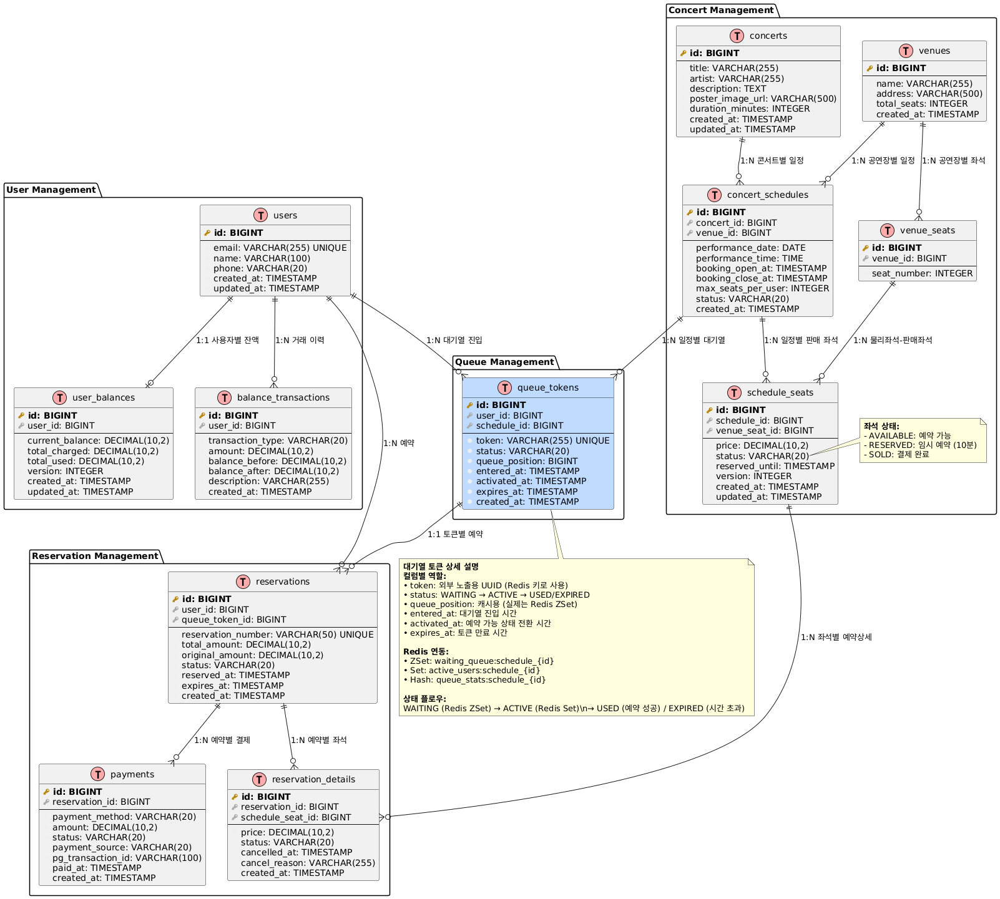

# 서버 설계 문서

## API 명세서

### 1. 유저 대기열 토큰 발급

**Endpoint**: `POST /api/v1/queue/tokens`

**Request**:
```json
{
  "userId": "number",
  "scheduleId": "number"
}
```

**Response**:
- **200 OK**: 토큰 발급 성공
```json
{
  "success": true,
  "data": {
    "token": "string (UUID)",
    "queuePosition": "number",
    "estimatedWaitTimeMinutes": "number",
    "status": "WAITING"
  }
}
```

**Error**:
- **400 Bad Request**: 잘못된 요청 데이터
- **404 Not Found**: 사용자 또는 스케줄이 존재하지 않음
- **409 Conflict**: 이미 해당 스케줄에 대한 토큰이 존재

**Authorization**: None (토큰 발급용)

---

### 2. 예약 가능 날짜 조회

**Endpoint**: `GET /api/v1/concerts/{concertId}/schedules`

**Request**:
- Path Parameters:
  - `concertId`: 콘서트 ID
- Query Parameters:
  - `fromDate` (optional): 조회 시작 날짜 (YYYY-MM-DD)
  - `toDate` (optional): 조회 종료 날짜 (YYYY-MM-DD)

**Response**:
- **200 OK**: 조회 성공
```json
{
  "success": true,
  "data": [
    {
      "scheduleId": "number",
      "concertId": "number",
      "concertTitle": "string",
      "venueId": "number",
      "venueName": "string",
      "performanceDate": "string (YYYY-MM-DD)",
      "performanceTime": "string (HH:mm:ss)",
      "bookingOpenAt": "string (ISO 8601)",
      "bookingCloseAt": "string (ISO 8601)",
      "availableSeats": "number",
      "status": "string"
    }
  ]
}
```

**Error**:
- **400 Bad Request**: 잘못된 날짜 형식 또는 콘서트 ID
- **404 Not Found**: 콘서트가 존재하지 않음
- **500 Internal Server Error**: 서버 오류

**Authorization**: Queue Token required (Header: `Queue-Token: {token}`)

---

### 3. 예약 가능 좌석 조회

**Endpoint**: `GET /api/v1/concerts/{concertId}/schedules/{scheduleId}/seats`

**Request**:
- Path Parameters:
  - `concertId`: 콘서트 ID
  - `scheduleId`: 스케줄 ID

**Response**:
- **200 OK**: 좌석 조회 성공
```json
{
  "success": true,
  "data": {
    "scheduleInfo": {
      "scheduleId": "number",
      "concertTitle": "string",
      "performanceDate": "string",
      "performanceTime": "string",
      "venueName": "string"
    },
    "seats": [
      {
        "seatId": "number",
        "seatNumber": "number",
        "price": "number",
        "status": "AVAILABLE"
      }
    ]
  }
}
```

**Error**:
- **400 Bad Request**: 잘못된 ID 값
- **401 Unauthorized**: 유효하지 않은 큐 토큰
- **404 Not Found**: 콘서트 또는 스케줄이 존재하지 않음

**Authorization**: Queue Token required (Header: `Queue-Token: {token}`)

---

### 4. 좌석 예약 요청

**Endpoint**: `POST /api/v1/reservations`

**Request**:
```json
{
  "scheduleId": "number",
  "seatIds": ["number", "number"],
  "userId": "number"
}
```

**Response**:
- **201 Created**: 예약 성공
```json
{
  "success": true,
  "data": {
    "reservationId": "number",
    "reservationNumber": "string",
    "userId": "number",
    "scheduleId": "number",
    "seats": [
      {
        "seatId": "number",
        "seatNumber": "number",
        "price": "number"
      }
    ],
    "totalAmount": "number",
    "status": "RESERVED",
    "reservedAt": "string (ISO 8601)",
    "expiresAt": "string (ISO 8601)"
  }
}
```

**Error**:
- **400 Bad Request**: 잘못된 요청 데이터
- **401 Unauthorized**: 유효하지 않은 큐 토큰
- **409 Conflict**: 이미 예약된 좌석
- **422 Unprocessable Entity**: 사용자당 최대 좌석 수 초과

**Authorization**: Queue Token required (Header: `Queue-Token: {token}`)

---

### 5. 잔액 충전

**Endpoint**: `POST /api/v1/users/{userId}/balance/charge`

**Request**:
- Path Parameters:
  - `userId`: 사용자 ID
- Body:
```json
{
  "amount": "number"
}
```

**Response**:
- **200 OK**: 충전 성공
```json
{
  "success": true,
  "data": {
    "userId": "number",
    "chargedAmount": "number",
    "currentBalance": "number",
    "transactionId": "number",
    "chargedAt": "string (ISO 8601)"
  }
}
```

**Error**:
- **400 Bad Request**: 잘못된 충전 금액 (0 이하 또는 최대 한도 초과)
- **404 Not Found**: 사용자가 존재하지 않음
- **500 Internal Server Error**: 서버 오류

**Authorization**: Queue Token required (Header: `Queue-Token: {token}`)

---

### 6. 잔액 조회

**Endpoint**: `GET /api/v1/users/{userId}/balance`

**Request**:
- Path Parameters:
  - `userId`: 사용자 ID

**Response**:
- **200 OK**: 조회 성공
```json
{
  "success": true,
  "data": {
    "userId": "number",
    "currentBalance": "number",
    "totalCharged": "number",
    "totalUsed": "number",
    "lastUpdated": "string (ISO 8601)"
  }
}
```

**Error**:
- **401 Unauthorized**: 유효하지 않은 큐 토큰
- **403 Forbidden**: 다른 사용자의 잔액 조회 시도
- **404 Not Found**: 사용자가 존재하지 않음

**Authorization**: Queue Token required (Header: `Queue-Token: {token}`)

---

### 7. 결제

**Endpoint**: `POST /api/v1/payments`

**Request**:
```json
{
  "reservationId": "number",
  "paymentMethod": "BALANCE",
  "userId": "number"
}
```

**Response**:
- **201 Created**: 결제 성공
```json
{
  "success": true,
  "data": {
    "paymentId": "number",
    "reservationId": "number",
    "userId": "number",
    "amount": "number",
    "paymentMethod": "BALANCE",
    "status": "COMPLETED",
    "paidAt": "string (ISO 8601)",
    "reservation": {
      "reservationNumber": "string",
      "seats": [
        {
          "seatNumber": "number",
          "price": "number"
        }
      ]
    }
  }
}
```

**Error**:
- **400 Bad Request**: 잘못된 요청 데이터
- **401 Unauthorized**: 유효하지 않은 큐 토큰
- **402 Payment Required**: 잔액 부족
- **404 Not Found**: 예약이 존재하지 않음
- **409 Conflict**: 이미 결제된 예약 또는 만료된 예약
- **422 Unprocessable Entity**: 결제 불가능한 상태

**Authorization**: Queue Token required (Header: `Queue-Token: {token}`)

---

### 공통 응답 형식

**성공 응답**:
```json
{
  "success": true,
  "data": { ... }
}
```

**실패 응답**:
```json
{
  "success": false,
  "error": {
    "code": "string",
    "message": "string",
    "details": { ... }
  }
}
```

### 인증 및 권한

- 모든 API (토큰 발급 제외)는 Queue Token을 요구합니다.
- Queue Token은 HTTP Header에 `Queue-Token: {token}` 형태로 전달됩니다.
- Queue Token은 해당 스케줄에 대한 접근 권한을 검증합니다.
- 토큰 상태가 ACTIVE인 경우에만 예약/결제가 가능합니다.

## ERD


## 인프라 구성도 


### 시스템 구성 요소

#### 사용자 접점
- **웹/모바일**: 사용자가 콘서트 예약을 위해 접속하는 화면

#### 로드밸런서
- **역할**: 많은 사용자 요청을 여러 서버로 골고루 분배

#### 애플리케이션 서버 (여러 대)
- **콘서트 API 서버**: 실제 비즈니스 로직을 처리하는 메인 서버들
- **주요 기능**: 대기열 관리, 좌석 예약, 결제 처리
- 서버 한 대가 죽어도 다른 서버가 계속 서비스 제공

#### 캐시 (Redis)
- **Redis 마스터**: 대기열 순서, 활성 사용자 정보를 빠르게 저장
- **Redis 슬레이브**: 마스터 데이터를 복사해서 읽기 전용으로 사용  
- 데이터베이스보다 훨씬 빠른 조회 속도 (대기열 확인 시 중요)

#### 데이터베이스 (MySQL)
- **MySQL 마스터**: 실제 데이터 저장 (사용자 정보, 콘서트 정보, 예약 데이터)
- **MySQL 슬레이브**: 마스터 데이터를 복사해서 읽기 전용으로 사용
- **마스터-슬레이브 구조**: 쓰기는 마스터에서, 읽기는 슬레이브에서 (성능 향상)

#### 백그라운드 작업
- **대기열 처리기**: 자동으로 대기 순서를 업데이트하고 토큰 만료 처리
- **예약 정리기**: 시간이 지난 예약을 자동으로 취소하고 좌석 해제

### 이해하기 쉬운 동작 흐름

1. **사용자 접속** → 로드밸런서가 적절한 서버로 연결
2. **대기열 확인** → Redis에서 빠르게 내 순서 조회  
3. **콘서트 정보 조회** → MySQL에서 콘서트/좌석 정보 가져오기
4. **좌석 예약** → Redis에 임시 잠금, MySQL에 예약 정보 저장
5. **결제 처리** → 사용자 잔액으로 결제 진행
6. **백그라운드 정리** → 만료된 예약 자동 취소

### 왜 이렇게 구성했나?

- **안정성**: 서버 한 대가 죽어도 서비스 중단 없음
- **성능**: Redis 캐시로 대기열을 빠르게 처리  
- **확장성**: 사용자가 많아져도 서버를 더 추가해서 대응
- **자동화**: 사람이 일일이 관리하지 않아도 시스템이 알아서 정리